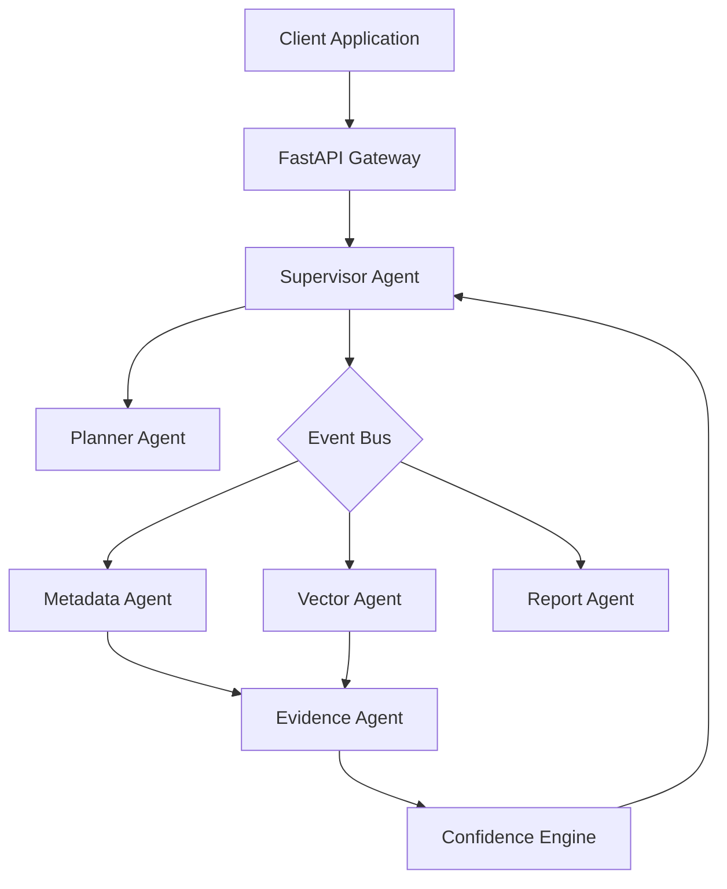

# VISTA AI

VISTA (Video Intelligence & Surveillance Thinking Agent) AI is a multi-agent AI system designed to intelligently monitor, search, and analyze large-scale physical security environments.

This project is currently undergoing a strict hardening and refactoring process (Phase A) before production model integration (Phase B).

## Current Project Status

The codebase is strictly gated into three states to prevent unvalidated claims:

### ✅ IMPLEMENTED & VALIDATED (Model-Free)
The following components have been fully implemented, structurally hardened, and mathematically validated using a model-free adversarial framework:
- **Supervisor Orchestration**: Event-driven execution of specialized agents (Metadata, Vector, Report).
- **Core Security invariants**: JWT production enforcement, Role-Based Access Control (RBAC), and strict camera authorization pushed down to the retrieval boundaries.
- **Data Stores**: Native in-memory/JSON implementations for Vector Store, Checkpoint Store, and Document Store.
- **Vector Math**: Strict L2-to-Similarity conversion, bounding box schema enforcement.
- **Fail-Safe Integrity**: Strict validation against hallucinated evidence, mock tool failures, and deterministic failure policies.

### 🟡 IMPLEMENTED (Model-Blocked / Awaiting Phase B)
The following code exists in the repository but is explicitly blocked from execution during Phase A to ensure foundational stability:
- **Real LLM Integration**: Gemini, SmolVLM, Qwen, Ollama, and external reasoning chains.
- **LangGraph Integration**: The LangGraph builder (`app/graph/builder.py`) scaffolding.
- **Intent Agent**: Temporarily decoupled from the DAG pending Phase B integration.

### 🔴 UNVALIDATED (Removed or Pending Refactor)
- Claims of "Production Observability" (OpenTelemetry, Jaeger, Prometheus) have been removed until explicitly validated.
- Claims of distributed processing have been removed until actual cloud deployment is validated.

## Architecture



## Quick Start (Model-Free Mode)

The system currently runs in a locked-down `native` mode that mocks infrastructure and external model calls to validate API contracts and system invariants.

### 1. Clone the repository
```bash
git clone https://github.com/vista-ai/vista_agentic_ai.git
cd vista_agentic_ai
```

### 2. Native Setup
Run the application completely locally without Docker. Infrastructure (PostgreSQL, Milvus, Redis) and Models are automatically gracefully mocked out.

```bash
make setup
make run
```
The API will be available at `http://localhost:8000`.

## Testing

The system enforces strict architectural boundaries using a model-free validation suite:

```bash
# Run structural adversarial tests
PYTHONPATH=. .venv/bin/pytest tests/unit/ tests/adversarial/

# Run the Phase A Model-Free E2E Acceptance Gate
PYTHONPATH=. .venv/bin/python scripts/validation/validate_codebase_model_free.py
```

## License

This project is licensed under the MIT License - see the LICENSE file for details.
