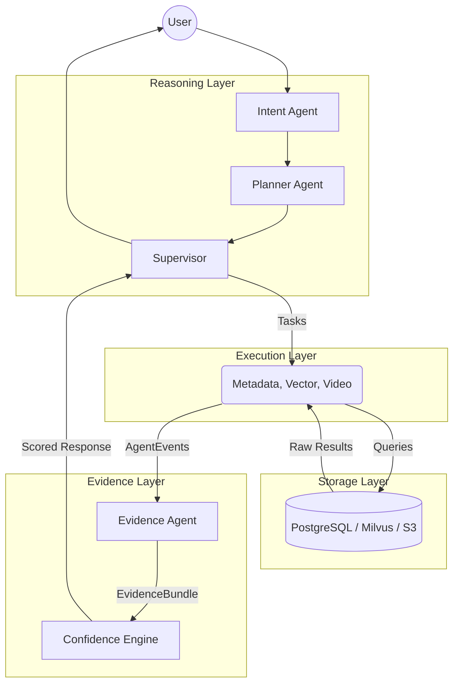

# Data Flow

The data flow within VISTA AI guarantees that raw infrastructure boundaries are completely isolated from reasoning boundaries.

1. **User Query**: Received via REST/WebSocket.
2. **Intent & Planning**: The orchestrator determines the optimal combination of tools.
3. **Execution**: The Supervisor dispatches tasks across the EventBus.
4. **Data Retrieval**: Domain agents query their respective databases.
5. **Evidence Alignment**: The Evidence agent subscribes to results, creating a unified temporal `EvidenceBundle`.
6. **Scoring**: The Confidence engine evaluates policies.
7. **Response**: Returned to the user.
