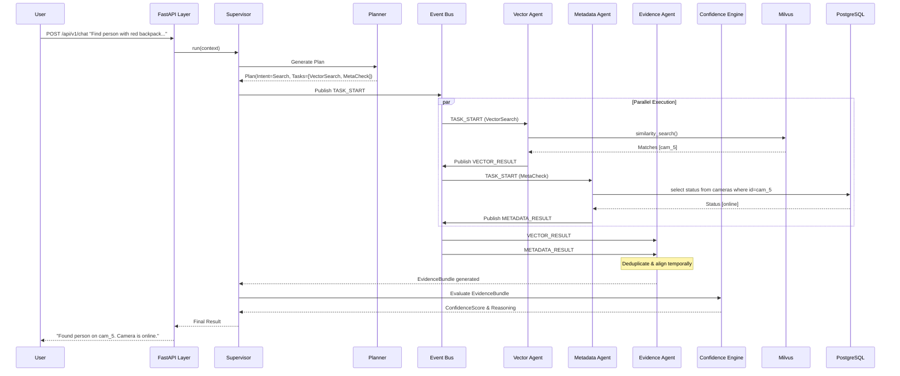
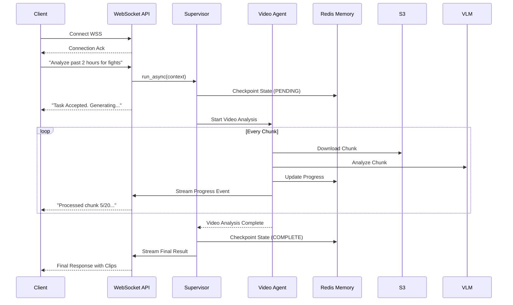

# Sequence Diagrams

These sequence diagrams illustrate the system interactions for various complex user queries.

## 1. Complex Reasoning Flow (Person Search + Metadata)

This flow occurs when a user asks: *"Find the person wearing a red backpack and check if the camera they are on is online."*

## 2. Long-Running Video Reasoning Flow

When analyzing video, the operation is asynchronous and uses WebSockets.

