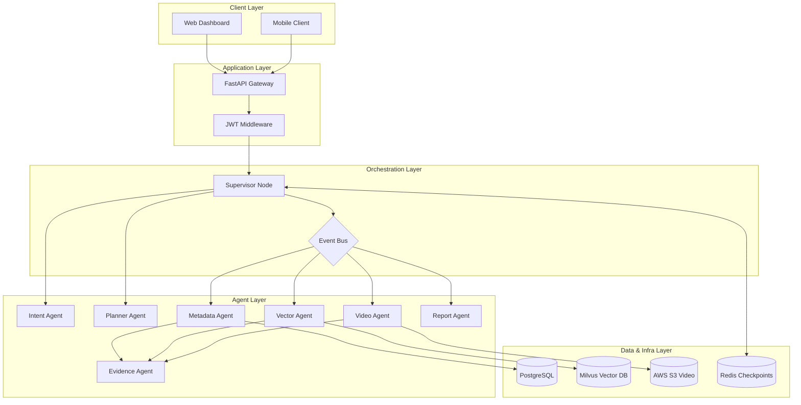

# System Architecture

VISTA AI follows an **Event-Driven Multi-Agent Architecture** layered over a fast, scalable service backend. It acts as an orchestrator bridging disparate data systems (PostgreSQL for structured metadata, Milvus for dense vectors, S3 for unstructured video).

## High-Level Topology

## Layer Descriptions

### 1. Application Layer (FastAPI)
The entry point to the system. Handles REST endpoints, WebSocket streaming, dependency injection, Request validation via Pydantic, and JWT-based authentication.

### 2. Orchestration Layer (LangGraph & Supervisor)
At the heart of the system is the **Supervisor Agent**. Built with LangGraph, it maintains a persistent graph state. 
- It maintains the global state and coordinates which agents need to run.
- It uses an **Event Bus** to asynchronously publish events that domain agents subscribe to, completely decoupling the execution of slow video analysis from fast metadata lookups.

### 3. Agent Layer (Reasoning)
Each agent is a single-responsibility system:
- **Intent Agent**: Classifies the query (e.g. Is this a status check? A complex video search?).
- **Planner Agent**: Generates an execution plan (which tools to call).
- **Metadata, Vector, Video**: The domain execution agents. They perform searches and publish raw events.
- **Evidence Agent**: Subscribes to results, deduplicates them, and aligns them temporally into an `EvidenceBundle`.
- **Confidence Engine**: Analyzes the evidence bundle against policies and scores the final response.

### 4. Memory & Infrastructure
- **Redis Checkpointer**: Thread-safe distributed memory. LangGraph utilizes this to save the execution graph state, enabling pausing, resuming, and long-running asynchronous execution.
- **OpenTelemetry**: Distributed tracing injecting TraceIDs across all boundaries. Exported to Jaeger/Prometheus.
